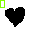
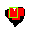
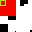
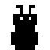
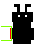
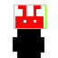
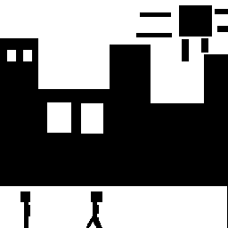
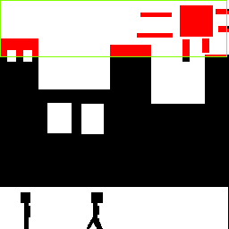
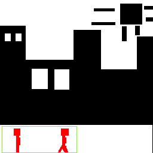
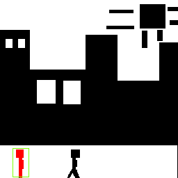

# Linear-Quad-Trees
 SD Project
### Example of input - output imaes of window query 
The green square illustrates the window query that was given. The quadtree blocks that were identified to intersect/to be contained in the window are colored red.

| Input image | Output Image |
|-------------|--------------|
|    Size: 32x32 |       |
|    Size: 32x32|  |
|    Size: 64x64 |  |
|   Size: 256x256 |   |

